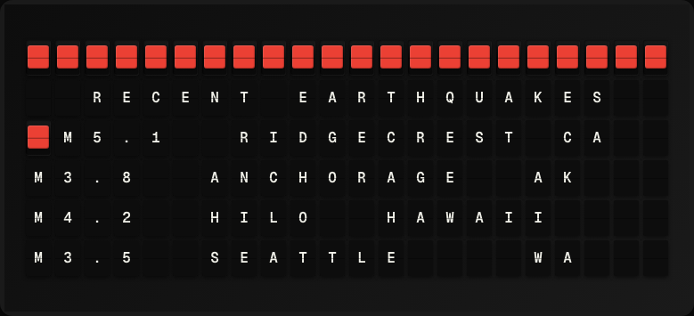

# Earthquake Monitor Plugin

Display recent significant earthquakes from the USGS real-time feed.



**→ [Setup Guide](./docs/SETUP.md)**

## Overview

The Earthquake Monitor plugin uses the USGS Earthquake Hazards Program GeoJSON feed to show the most recent significant earthquakes worldwide. Configure a minimum magnitude threshold and an optional radius around a location. No API key required.

## Template Variables

| Variable | Description | Example |
|---|---|---|
| `earthquake.magnitude` | Magnitude of the most recent earthquake | `6.1` |
| `earthquake.location` | Location description of the most recent earthquake | `50km NE of Tokyo` |
| `earthquake.depth_km` | Focal depth in km | `12.4` |
| `earthquake.count` | Number of earthquakes in the feed | `3` |
| `earthquake.time_ago` | How long ago the most recent quake occurred | `2h ago` |

## Example Templates

```
EARTHQUAKES
M{{earthquake.magnitude}} {{earthquake.location}}
Depth: {{earthquake.depth_km}} km
{{earthquake.time_ago}}
Total today: {{earthquake.count}}

```

## Configuration

| Setting | Name | Description | Required |
|---|---|---|---|
| `min_magnitude` | Minimum Magnitude | Only show earthquakes at or above this magnitude. | No |
| `feed` | Feed Type | Which USGS feed to use. | No |

## Features

- USGS real-time GeoJSON feed
- Configurable magnitude threshold
- Multiple feed types (significant, 4.5+, 2.5+, 1.0+)
- Location and depth data
- No API key required

## Author

FiestaBoard Team
